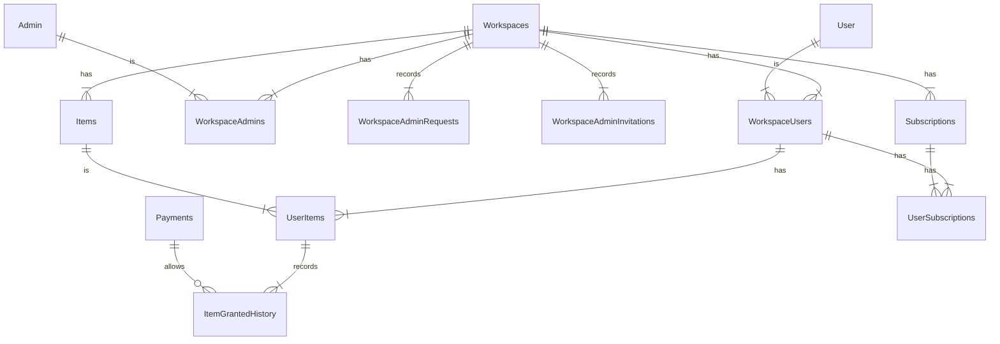

# Design Docs

## Overview

이 프로젝트는 NestJS와 TypeORM을 활용하여 간단한 서비스 API 작성과 E2E 테스트를 구현한 샘플형 프로젝트입니다.

## Context

이 프로젝트는 크게 워크스페이스를 중심으로 Admin 영역과 User 영역으로 나눠집니다. Slack이나 Discord 처럼 유저가 Admin 혹은 Moderator가 될 수 있는 것과 달리, Admin 전용 계정과 User 계정은 분리되어 관리됩니다.

워크스페이스는 특정 목적으로 Admin이 User에게 제공하고 싶은 서비스들을 구현할 수 있지만, 이 프로젝트는 그 보다는 Admin이 할 수 있는 기본 Action, User가 할 수 기본 Action 의 구현에만 집중을 하였고, 유저가 재화처럼 사용 가능한 Item, 유저의 Subscription 기능, 추상화된 결제 검증 기능을 포함합니다. (현재, Subscription 기능은 구현이 일부 누락되었으며, Test code에서도 제외되었습니다.)

## Goals

- Admin
  - 기본 회원 가입 및 로그인 (워크스페이스별 독립 토큰)
  - email을 이용한 특정 워크스페이스 초대 기능 및 취소 기능
  - 관리중인 워크스페이스의 User 목록 및 차단/회복 기능
  - 재화 Item 생성 기능 및 관리 기능
  - 특정 User에게 Item 지급 및 기록 확인 기능
  - 구독 생성 및 관리 기능
- User
  - 기본 회원 가입 및 로그인 (워크스페이스별 독립 토큰)
  - 쉬운 워크스페이스 합류 및 탈퇴
  - Item 구매 기능
  - 구독 시작 기능

## Non-Goals

- 서비스 기능 구현
  - 이는 재화나 워크스페이스 내에서 뭔가 상호작용 - 예를 들어 채팅 - 기능

### Caveats

- 구독 관련 기능은 완전히 구현되지 않음. 업데이트 시 지금 항목은 제거될 것임

## Design

### DB-Schema



Admin, User : 전체 시스템에서 실제 사용자와 1대1로 매칭되는 정보를 갖습니다.

WorkspaceAdmins, WorkspaceUsers : 워크스페이스별 유저와 매칭되는 정보를 갖습니다.

WorkspaceAdminRequests, WorkspaceAdminInvitations : Admin의 초대 혹은 참여 요청 관련 정보입니다.

Items : 워크스페이스별 고유 재화 정보입니다.

UserItems : 유저의 재화 정보입니다. 남아 있는 재화값이 포함됩니다.

Payments : 지불 관련 외부 데이터 정보가 포함됩니다.

ItemGrantedHistory : 아이템 사용 이력이 관리됩니다.

### APIs

여기서는 별도로 설명하지 않고, Swagger 기능으로 대체합니다.

다음의 명령어로 인스턴스를 부팅합니다.

```bash
$ yarn start:dev
```

이후 [Swagger](http://localhost:3000/api/doc)페이지에서 API 목록 확인이 가능합니다.

### Tests

해당 프로젝트에서는 Unit Test 코드를 작성하거나 테스트하지 않았습니다.

```bash
$ yarn run test
```

명령어는 실패합니다.

다만, E2E는 작성되어 있으며, 소스코드에 포함된 docker-compose.yaml의 컨테이너가 필요합니다.

로컬에 도커 컨테이너를 띄운 후,

```bash
$ yarn run test:e2e
```

를 통해 E2E 테스트를 진행합니다. 테스트는 개인이 테스트 목적으로 작성했기에
별도 모듈별 테스트가 아닌 One-shot으로 연계하여 기능 테스트가 이루어집니다.

준비된 PostgreSQL, Redis 컨테이너가 있을 경우, `.env` 파일 내의 경로를 조작하면 됩니다.

_이후 내용은 NestJS의 README.md 내용입니다._

---

<p align="center">
  <a href="http://nestjs.com/" target="blank"></a>
</p>

[circleci-image]: https://img.shields.io/circleci/build/github/nestjs/nest/master?token=abc123def456
[circleci-url]: https://circleci.com/gh/nestjs/nest

  <p align="center">A progressive <a href="http://nodejs.org" target="_blank">Node.js</a> framework for building efficient and scalable server-side applications.</p>
    <p align="center">
<a href="https://www.npmjs.com/~nestjscore" target="_blank"></a>
<a href="https://www.npmjs.com/~nestjscore" target="_blank"></a>
<a href="https://www.npmjs.com/~nestjscore" target="_blank"></a>
<a href="https://circleci.com/gh/nestjs/nest" target="_blank"></a>
<a href="https://coveralls.io/github/nestjs/nest?branch=master" target="_blank"></a>
<a href="https://discord.gg/G7Qnnhy" target="_blank"></a>
<a href="https://opencollective.com/nest#backer" target="_blank"></a>
<a href="https://opencollective.com/nest#sponsor" target="_blank"></a>
  <a href="https://paypal.me/kamilmysliwiec" target="_blank"></a>
    <a href="https://opencollective.com/nest#sponsor"  target="_blank"></a>
  <a href="https://twitter.com/nestframework" target="_blank"></a>
</p>
  <!--[](https://opencollective.com/nest#backer)
  [](https://opencollective.com/nest#sponsor)-->

## Description

[Nest](https://github.com/nestjs/nest) framework TypeScript starter repository.

## Installation

```bash
$ yarn install
```

## Running the app

```bash
# development
$ yarn run start

# watch mode
$ yarn run start:dev

# production mode
$ yarn run start:prod
```

## Test

```bash
# unit tests
$ yarn run test

# e2e tests
$ yarn run test:e2e

# test coverage
$ yarn run test:cov
```

## Support

Nest is an MIT-licensed open source project. It can grow thanks to the sponsors and support by the amazing backers. If you'd like to join them, please [read more here](https://docs.nestjs.com/support).

## Stay in touch

- Author - [Kamil Myśliwiec](https://kamilmysliwiec.com)
- Website - [https://nestjs.com](https://nestjs.com/)
- Twitter - [@nestframework](https://twitter.com/nestframework)

## License

Nest is [MIT licensed](LICENSE).
